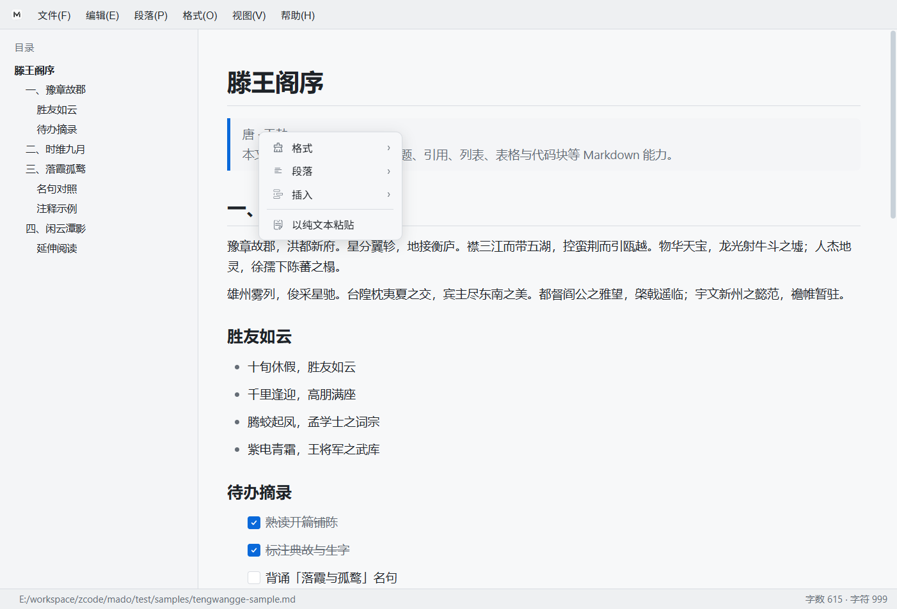

# 📝 Mado

一款简洁、高效、免费的 Markdown 编辑器，专为写作而生。

> ⚠️ **项目状态说明**：本项目目前已进入**维护模式**，不再开发新功能，仅修复 Bug 和进行必要的兼容性维护。如果你需要更多高级功能，建议寻找其他更活跃的替代方案。

## ✨ 特性

* 📄 即时渲染编辑，所见即所得
* 🌙 浅色 / 深色主题，支持字体缩放
* 📑 目录大纲（可显示 / 隐藏），点击跳转
* 🔍 全文搜索，匹配高亮与上一项 / 下一项
* 📊 表格编辑（插入行列、对齐、多格选区）、任务列表、代码高亮
* 📎 拖拽打开本地 Markdown，导出 HTML / PDF
* 🔒 纯本地运行，不收集个人信息
* ⚡ 轻量快速，启动即写

## 📥 下载

| 平台                        | 下载链接                                                                                                                        | 状态    |
| ------------------------- | --------------------------------------------------------------------------------------------------------------------------- | ----- |
| Windows x64               | [GitHub Releases](https://github.com/llllnnbbbb/mado/releases) · [Gitee Releases](https://gitee.com/llllnnbbbb/mado/releases) | ✅ 已支持 |
| macOS (Apple Silicon M芯片) | —                                                                                                                           | 暂无    |
| Android                   | —                                                                                                                           | 暂无    |

> 💡 iPhone / iPad 暂不支持（没有开发者账号，懂的都懂 😢）

## 📖 用户手册

👉 [查看用户手册](docs/manual/用户手册.md)（界面说明、目录开关、表格与快捷键等）

## 💖 支持作者

如果这个工具对你有帮助，欢迎请我喝杯咖啡 ☕

**软件完全免费，打赏自愿，感谢你的支持！**

## 📄 许可证

本项目采用 [MIT License](LICENSE) 授权，源代码仅供学习参考，未经授权不得用于商业目的。

***

📮 反馈建议请提 [Issue](https://github.com/mmuuyyuu/mado/issues)
