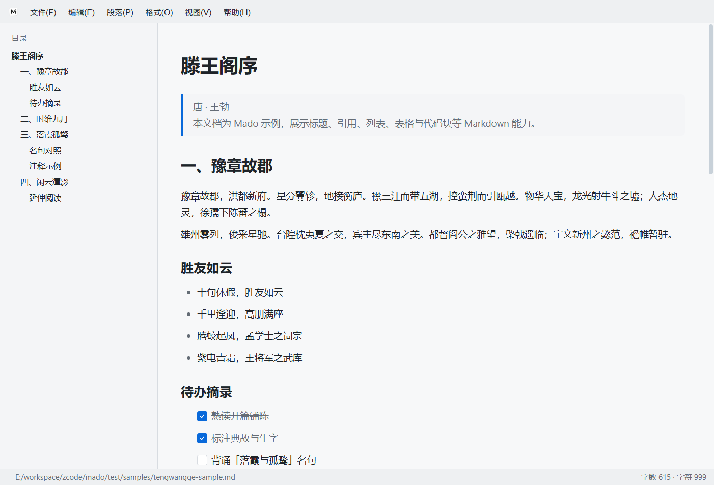
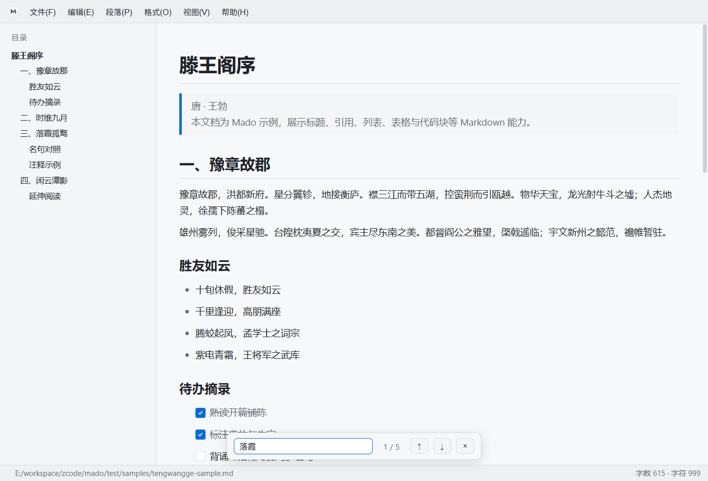
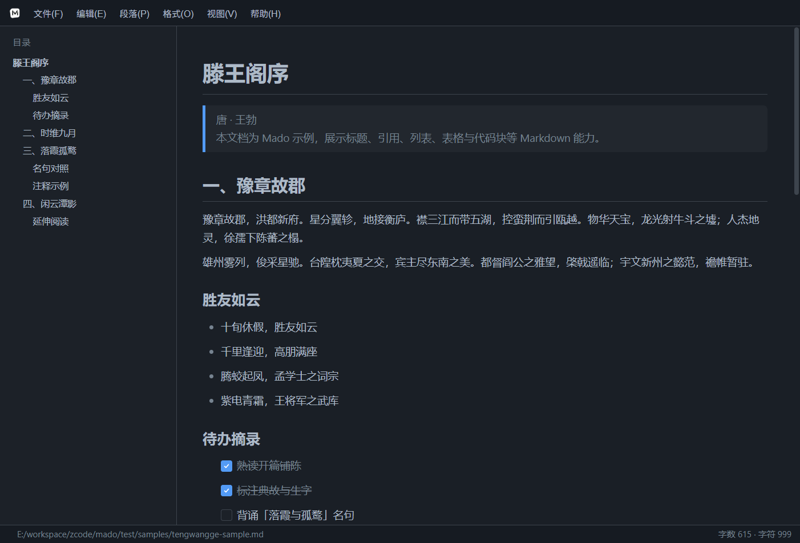
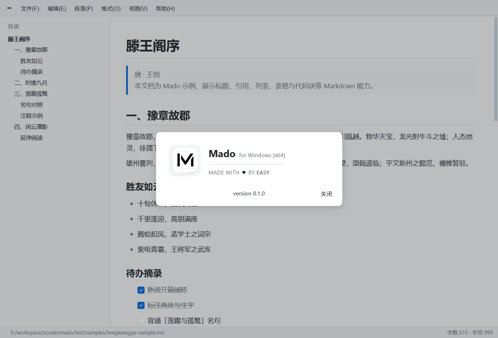

# Mado 用户手册

Mado 是一款 Markdown 桌面编辑器，支持即时渲染编辑。本文以同目录下的示例文档《滕王阁序》节选（`samples/tengwangge-sample.md`）介绍 Mado 的特色功能与不易发现的快捷操作。

---

## 1. 界面概览

| 区域 | 说明 |
|------|------|
| **标题栏** | 左侧为目录切换按钮（见下节）；中间为菜单栏；右侧为窗口控制按钮 |
| **目录** | 左侧大纲，根据文档标题自动生成 |
| **编辑区** | 中央正文，Markdown 即时渲染 |
| **状态栏** | 底部显示文件路径、字数与字符数 |

---

## 2. 显示 / 隐藏目录

目录侧栏的开关**不在菜单里**，而是藏在标题栏左上角，初次使用容易忽略。

### 操作方式

1. 看窗口**左上角**：平时显示 **Mado 应用图标**（字母 M 或程序图标）。
2. 将鼠标**悬停**在该图标上，图标会变为：
   - **展开侧边栏** —— 当前目录已隐藏时
   - **关闭侧边栏** —— 当前目录已显示时
3. **单击**该按钮，即可切换目录的显示与隐藏。

> 提示：悬停时按钮下方会出现文字提示「展开侧边栏」或「关闭侧边栏」，可据此确认当前状态。

### 目录能做什么

- 自动扫描文档中的 `#` 标题（一级～六级），生成层级大纲。
- **单击**某一条目，编辑区会滚动并定位到对应标题（示例文档中如「一、豫章故郡」「三、落霞孤鹜」等）。

隐藏目录后，编辑区会向左扩展，适合专注写作；需要跳转时再按上述方式重新展开即可。

---

## 3. 打开与导出

| 操作 | 说明 |
|------|------|
| **拖拽打开** | 将 `.md` / `.markdown` / `.txt` 等文件拖入窗口即可打开 |
| **导出 HTML** | 文件 → 导出 HTML…（`Ctrl+E`），生成带内嵌样式的完整网页 |
| **导出 PDF** | 文件 → 导出 PDF…（`Ctrl+Shift+P`） |

### 外部修改冲突

若文档在 Mado 之外被其它程序修改，会弹出对话框：

- **同步磁盘版本**：用磁盘上的新内容覆盖编辑器
- **保留并保存当前内容**：保留当前编辑内容并写回磁盘

---

## 4. 段落与格式

除菜单栏 **段落(P)**、**格式(O)** 外，编辑区**右键**也可快速设置格式。

### 段落（段落菜单 / 右键 › 段落）

| 功能 | 快捷键 |
|------|--------|
| 一级～六级标题 | `Ctrl+1` … `Ctrl+6` |
| 段落 | `Ctrl+0` |
| 提升 / 降低标题级别 | `Ctrl+=` / `Ctrl+-` |
| 代码块 | `Ctrl+Shift+K` |
| 引用 | `Ctrl+Shift+Q` |
| 有序 / 无序 / 任务列表 | `Ctrl+Shift+[` / `Ctrl+Shift+]` / `Ctrl+Shift+X` |
| 水平分割线 | 菜单「水平分割线」；或在行首输入 `---` 后回车 |

### 格式（格式菜单 / 右键 › 格式）

| 功能 | 快捷键 |
|------|--------|
| 加粗 / 斜体 | `Ctrl+B` / `Ctrl+I` |
| 行内代码 | `Ctrl+Shift+\`` |
| 删除线 | `Alt+Shift+5` |
| 注释 | 菜单「注释」（插入 `<!-- … -->`，编辑器内弱化显示，导出时不出现） |

选中文字后右键，顶部会出现 **查找"…"**，可一键带入搜索栏。

---

## 5. 搜索

按 `Ctrl+F` 打开搜索栏：

- 文档中所有匹配项会高亮
- `Enter`：下一个；`Shift+Enter`：上一个
- `Esc` 或 × 关闭

在示例文档中搜索「落霞」，可快速定位名句段落。

---

## 6. 表格

### 插入

编辑区右键 → **插入 → 表格…**，设置行数、列数后确认。

### 编辑技巧

- **拖拽**可选中多个单元格；选中后右键出现 **表格 ›** 子菜单。
- 表格边缘**悬停**可出现 **+** 按钮，快速插入行/列。
- **Delete / Backspace**：
  - 单格：清空内容
  - 选中整行/列/多格：删除对应结构
  - 选中全部单元格：删除整张表
- 多格选中后**右键**，选区会保持高亮（便于继续操作）。

| 分组 | 功能 |
|------|------|
| 选区 | 选择整行、选择整列 |
| 结构 | 插入行/列、删除行/列（表头行上方不可插入行） |
| 内容 | 清空选中单元格 |
| 对齐 | 左对齐、居中、右对齐 |

---

## 7. 视图与主题

| 操作 | 菜单 / 快捷键 |
|------|----------------|
| 浅色主题 | 视图 → 浅色主题 |
| 深色主题 | 视图 → 深色主题 |
| 放大 / 缩小 / 重置 | `Ctrl+Shift+=` / `Ctrl+Shift+-` / `Ctrl+Shift+0` |
| 开发者工具 | 视图 → 开发者工具（`Ctrl+Shift+I`），Windows 下内嵌于窗口右侧 |

主题与缩放会自动记住，下次启动时恢复。

---

## 8. 帮助

| 菜单项 | 说明 |
|--------|------|
| 隐私声明 | 在 Mado 内打开 `PRIVACY.md` |
| 项目网站 | 打开 GitHub 项目页 |
| 关于 Mado | 版本、平台与作者信息 |

---

## 9. 示例文档

本目录 `samples/` 下提供以《滕王阁序》为主题的示例 Markdown：

| 文件 | 说明 |
|------|------|
| `samples/tengwangge-sample.md` | 完整示例：标题、引用、列表、任务、表格、代码块、注释等 |
| `samples/tengwangge-short.md` | 短节选 |

在 Mado 中打开上述文件即可体验。手册截图位于仓库根目录 `images/`。

---

## 10. 常见问题

**Q：找不到开关目录的地方？**  
A：看标题栏**最左侧**图标，鼠标悬停后会变成侧边栏展开/关闭图标，单击即可。不在任何菜单里。

**Q：标题栏下方为什么有一条细线？**  
A：为适配 Windows 窗口按钮区域而设计，属正常布局。

**Q：其它程序改了文件会怎样？**  
A：Mado 会监听文件变化并弹出对话框，由您选择同步磁盘或保留当前内容。

---

## 11. 特色快捷键

| 快捷键 | 功能 |
|--------|------|
| `Ctrl+F` | 查找 |
| `Ctrl+1`～`Ctrl+6` | 一级～六级标题 |
| `Ctrl+Shift+K` | 代码块 |
| `Ctrl+Shift+X` | 任务列表 |
| `Ctrl+E` | 导出 HTML |
| `Ctrl+Shift+P` | 导出 PDF |
| `Ctrl+Shift+I` | 开发者工具 |

其余常用操作见各菜单项标注。

---

*Mado · Markdown 编辑器 / 阅读器 · 用户手册*
